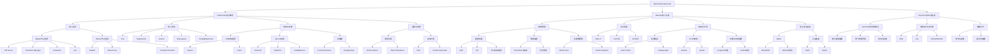

## Claude 
# Rancher 和 Kubernetes 知识结构图

## 一、Kubernetes (K8s) 核心概念

```
Kubernetes
├── 基础架构
│   ├── Master 组件
│   │   ├── API Server - 集群的统一入口，提供认证、授权、API注册和发现等机制
│   │   ├── etcd - 分布式键值存储系统，保存了整个集群的状态
│   │   ├── Controller Manager - 负责维护集群的状态，如故障检测、自动扩展、滚动更新等
│   │   ├── Scheduler - 负责资源的调度，按照预定的调度策略将Pod调度到相应的节点上
│   │   └── Cloud Controller Manager - 与云服务商交互的控制器
│   │
│   └── Node 组件
│       ├── Kubelet - 维护容器的生命周期，同时也负责Volume和网络的管理
│       ├── Container Runtime - 负责镜像管理以及Pod和容器的真正运行（如Docker）
│       └── Kube-proxy - 负责为Service提供集群内部的服务发现和负载均衡
│
├── 核心资源对象
│   ├── Pod - K8s最小部署单元，包含一组容器和卷
│   ├── ReplicaSet - 确保Pod副本数量符合预期状态
│   ├── Deployment - 声明式更新Pod和ReplicaSet
│   ├── StatefulSet - 管理有状态应用
│   ├── DaemonSet - 确保所有（或部分）节点上运行一个Pod副本
│   ├── Job/CronJob - 批处理任务/定时任务
│   ├── Service - 定义Pod的访问方式，为Pod提供固定访问地址
│   │   ├── ClusterIP - 集群内部IP，默认类型
│   │   ├── NodePort - 通过节点IP+端口访问服务
│   │   ├── LoadBalancer - 使用云提供商的负载均衡器
│   │   └── ExternalName - 返回CNAME记录
│   ├── Ingress - HTTP/HTTPS路由规则集合
│   ├── ConfigMap/Secret - 配置管理
│   ├── PersistentVolume (PV) - 存储资源
│   └── PersistentVolumeClaim (PVC) - 存储资源请求
│
├── 网络
│   ├── Pod网络
│   ├── Service网络
│   ├── 网络策略 (NetworkPolicy)
│   └── CNI插件 (Calico, Flannel, Cilium等)
│
└── 安全
    ├── 认证 (Authentication)
    ├── 授权 (Authorization)
    ├── 准入控制 (Admission Control)
    ├── ServiceAccount
    ├── RBAC (基于角色的访问控制)
    └── Pod安全策略
```

## 二、Rancher 平台

```
Rancher
├── 核心功能
│   ├── 多集群管理 - 统一管理多个K8s集群
│   ├── 用户界面 - 直观的Web UI管理K8s资源
│   ├── 认证与授权 - 集成多种身份验证提供商
│   ├── 应用商店 - 一键部署应用
│   └── 多租户支持 - 项目和命名空间隔离
│
├── 集群管理
│   ├── 创建集群
│   │   ├── RKE (Rancher Kubernetes Engine) - Rancher自己的K8s发行版
│   │   ├── 导入现有集群
│   │   └── 云提供商集成 (GKE, EKS, AKS等)
│   ├── 集群监控
│   ├── 集群告警
│   ├── 集群日志
│   └── 集群备份与恢复
│
├── 工作负载管理
│   ├── 部署工作负载
│   ├── 服务发现与负载均衡
│   ├── 存储管理
│   └── 配置管理
│
├── Rancher组件
│   ├── Rancher Server - 核心管理组件
│   ├── Rancher Agent - 安装在被管理集群上的代理
│   ├── RKE - Rancher Kubernetes Engine
│   └── K3s - 轻量级Kubernetes发行版
│
└── 扩展生态
    ├── 项目监控
    ├── 日志聚合
    ├── CI/CD集成
    ├── OPA Gatekeeper - 策略管理
    └── Istio - 服务网格
```

## 三、详细说明

### Kubernetes 核心概念详解

#### 基础架构

**Master 组件**:
- **API Server**: 是Kubernetes控制平面的前端，处理REST操作并更新etcd中对应的对象。所有的组件都会通过API Server进行通信。
- **etcd**: 一致且高可用的键值存储，用于存储所有集群数据。确保Kubernetes的所有状态数据都有备份。
- **Controller Manager**: 运行控制器进程，这些控制器包括节点控制器、副本控制器、端点控制器等，负责监视集群状态并使其与期望状态一致。
- **Scheduler**: 监视新创建的Pod，并将其分配到节点上。调度决策考虑资源需求、硬件/软件/策略约束、亲和性规范等。

**Node 组件**:
- **Kubelet**: 在每个节点上运行的代理，确保容器在Pod中运行。
- **Container Runtime**: 负责运行容器的软件，如Docker、containerd、CRI-O等。
- **Kube-proxy**: 维护节点上的网络规则，允许从集群内部或外部与Pod进行网络通信。

#### 核心资源对象

**Pod**: 
- Kubernetes中最小的可部署单元
- 包含一个或多个容器，共享网络命名空间和存储卷
- 通常由控制器（如Deployment）管理

**Deployment**:
- 提供声明式更新功能
- 管理ReplicaSet，确保应用程序的期望状态
- 支持滚动更新和回滚功能

**Service**:
- 为一组Pod提供统一的访问策略
- 提供固定IP地址和DNS名称
- 支持多种类型：ClusterIP、NodePort、LoadBalancer、ExternalName

**Ingress**:
- 管理集群外部访问集群内服务的HTTP/HTTPS路由
- 提供负载均衡、SSL终止和基于名称的虚拟主机

**ConfigMap/Secret**:
- ConfigMap用于存储非敏感配置数据
- Secret用于存储敏感信息，如密码、OAuth令牌和SSH密钥

**PersistentVolume (PV) 和 PersistentVolumeClaim (PVC)**:
- PV是集群中的存储资源
- PVC是用户对存储的请求
- 两者通过绑定关系连接

#### 网络

**Pod网络**:
- 每个Pod有自己的IP地址
- 同一Pod内的容器共享网络命名空间，可通过localhost通信

**Service网络**:
- 为Pod提供稳定的网络标识
- 实现负载均衡和服务发现

**网络策略 (NetworkPolicy)**:
- 定义Pod间通信规则
- 基于标签选择器控制流量

**CNI插件**:
- 容器网络接口的实现
- 常见插件：Calico、Flannel、Cilium等

#### 安全

**认证与授权**:
- 认证确定谁可以访问API服务器
- 授权确定已认证用户可以做什么

**RBAC (基于角色的访问控制)**:
- 通过Role和ClusterRole定义权限
- 通过RoleBinding和ClusterRoleBinding将角色分配给用户

### Rancher 平台详解

#### 核心功能

**多集群管理**:
- 统一界面管理多个Kubernetes集群
- 支持不同云提供商和本地集群

**用户界面**:
- 直观的Web UI简化Kubernetes管理
- 可视化工作负载、服务、配置等资源

**认证与授权**:
- 集成多种身份验证提供商（如Active Directory、GitHub、LDAP）
- 细粒度的访问控制

**应用商店**:
- 预配置的应用模板库
- 简化应用部署和升级

#### 集群管理

**创建集群**:
- **RKE**: Rancher自己的Kubernetes发行版，简化部署和管理
- **导入现有集群**: 管理已有的Kubernetes集群
- **云提供商集成**: 直接创建和管理GKE、EKS、AKS等云服务商的Kubernetes集群

**集群监控与告警**:
- 基于Prometheus的监控解决方案
- 可配置的告警规则和通知渠道

**集群日志**:
- 集中式日志收集和分析
- 支持多种日志存储后端

#### Rancher组件

**Rancher Server**:
- 核心管理组件
- 提供API和Web UI

**RKE (Rancher Kubernetes Engine)**:
- 简化的Kubernetes安装工具
- 支持高可用配置

**K3s**:
- 轻量级Kubernetes发行版
- 适用于边缘计算、IoT设备等资源受限环境

#### 扩展生态

**CI/CD集成**:
- 与Jenkins、GitLab等CI/CD工具集成
- 内置的Pipeline功能

**服务网格**:
- 集成Istio服务网格
- 提供流量管理、安全和可观察性

## 四、Rancher与Kubernetes的关系

Rancher是建立在Kubernetes之上的管理平台，它简化了Kubernetes的部署和管理。通过Rancher，用户可以：

1. **统一管理多个Kubernetes集群**：无论是自建的、云提供商的还是Rancher创建的集群
2. **简化操作**：通过直观的UI代替复杂的命令行操作
3. **增强功能**：添加监控、日志、告警、CI/CD等企业级功能
4. **多租户支持**：通过项目和命名空间隔离实现多团队使用同一集群

Rancher不仅仅是Kubernetes的管理工具，它还提供了完整的容器管理平台，使组织能够在生产环境中更有效地运行容器。

## 五、学习路径建议

1. **Kubernetes基础**：首先理解Pod、Service、Deployment等核心概念
2. **Kubernetes网络**：了解Pod网络、Service网络和Ingress
3. **Kubernetes存储**：学习PV、PVC和StorageClass
4. **Rancher基础**：安装Rancher并创建测试集群
5. **Rancher多集群管理**：学习如何管理多个集群
6. **Rancher应用部署**：使用应用商店部署应用
7. **高级功能**：探索监控、日志、CI/CD等功能

通过这个结构化的知识图谱，您可以系统地了解Kubernetes和Rancher的核心概念和它们之间的关系，为深入学习和实践打下坚实基础。

        
## Gemini
好的，为了帮助你这位 Rancher 和 Kubernetes (K8s) 的新手建立一个结构化的知识体系，我将为你创建一个从主干到分支的知识图谱，并对每个关键知识点进行详细说明。

这个结构将首先关注 Kubernetes 的核心概念，因为它是 Rancher 管理的基础。然后，我们将扩展到 Rancher，说明它是如何简化和增强 Kubernetes 的管理的。

```
**容器编排与管理核心知识图谱 (Container Orchestration & Management Core Knowledge Map)**

└── **I. Kubernetes (K8s) - 容器编排引擎 (Container Orchestration Engine)** [主干]
    │   *说明: Kubernetes 是一个开源平台，用于自动化容器化应用程序的部署、扩展和管理。它是现代云原生应用的基础设施核心。*
    │
    ├── **A. K8s 核心概念与架构 (Core Concepts & Architecture)** [分支]
    │   │
    │   ├── **1. Cluster (集群):**
    │   │   │   *说明: K8s 的基本单元，由一组协同工作的节点（物理机或虚拟机）组成。包含控制平面和工作节点。*
    │   │
    │   ├── **2. Node (节点):**
    │   │   │   *说明: 集群中的一台工作机器。可以是物理机或虚拟机。*
    │   │   │   ├── **Control Plane Node (控制平面节点/Master):**
    │   │   │   │   *说明: 运行管理集群所需的核心组件（API Server, etcd, Scheduler, Controller Manager）。负责决策和管理。*
    │   │   │   └── **Worker Node (工作节点):**
    │   │   │       *说明: 运行用户应用程序容器（在 Pod 中）的节点。包含 Kubelet, Kube-proxy, Container Runtime。*
    │   │
    │   ├── **3. Control Plane Components (控制平面组件):**
    │   │   │   ├── **API Server (kube-apiserver):**
    │   │   │   │   *说明: K8s 控制平面的前端，暴露 K8s API。所有组件（kubectl, UI, 其他控制器）都通过它交互。*
    │   │   │   ├── **etcd:**
    │   │   │   │   *说明: 一个高可用的键值存储，用作 K8s 所有集群数据的后台存储（配置、状态等）。*
    │   │   │   ├── **Scheduler (kube-scheduler):**
    │   │   │   │   *说明: 监视新创建的、未指定运行节点的 Pod，并选择一个节点让 Pod 在上面运行。*
    │   │   │   └── **Controller Manager (kube-controller-manager):**
    │   │   │       *说明: 运行核心控制循环（控制器），如节点控制器、副本控制器等，以驱动集群状态趋向期望状态。*
    │   │
    │   └── **4. Node Components (节点组件):**
    │       │   ├── **Kubelet:**
    │       │   │   *说明: 在每个节点上运行的代理，确保 Pod 中的容器运行正常。接收 PodSpec 并管理容器生命周期。*
    │       │   ├── **Kube-proxy:**
    │       │   │   *说明: 在每个节点上运行的网络代理，维护网络规则，实现 K8s Service 的概念（服务发现和负载均衡）。*
    │       │   └── **Container Runtime (容器运行时):**
    │       │       *说明: 负责运行容器的软件，如 Docker, containerd, CRI-O。Kubelet 通过 CRI (Container Runtime Interface) 与其交互。*
    │
    ├── **B. K8s 工作负载 (Workloads)** [分支]
    │   │   *说明: 定义如何在 K8s 上运行应用程序的对象。*
    │   │
    │   ├── **1. Pod:**
    │   │   │   *说明: K8s 中可以创建和管理的最小部署单元。一个 Pod 包含一个或多个紧密关联的容器，共享网络和存储。是应用的原子单元。*
    │   │
    │   ├── **2. ReplicaSet:**
    │   │   │   *说明: 确保在任何给定时间运行指定数量的 Pod 副本。主要由 Deployment 管理，通常不直接使用。*
    │   │
    │   ├── **3. Deployment:**
    │   │   │   *说明: (最常用) 声明式地管理 Pod 和 ReplicaSet。提供滚动更新、回滚、扩缩容等功能。适合无状态应用。*
    │   │
    │   ├── **4. StatefulSet:**
    │   │   │   *说明: 管理有状态应用的工作负载 API 对象。保证 Pod 的部署和扩展顺序、唯一的网络标识符和持久存储。适合数据库、消息队列等。*
    │   │
    │   ├── **5. DaemonSet:**
    │   │   │   *说明: 确保全部（或部分）Node 上都运行一个 Pod 的副本。常用于运行集群存储守护进程、日志收集守护进程或节点监控守护进程。*
    │   │
    │   ├── **6. Job:**
    │   │   │   *说明: 创建一个或多个 Pod，并确保指定数量的 Pod 成功终止。用于执行一次性任务。*
    │   │
    │   └── **7. CronJob:**
    │       │   *说明: 管理基于时间的 Job，即：在给定的时间点/重复周期执行 Job。*
    │
    ├── **C. K8s 服务发现与网络 (Service Discovery & Networking)** [分支]
    │   │
    │   ├── **1. Service:**
    │   │   │   *说明: 将运行在一组 Pods 上的应用程序公开为网络服务的抽象方法。提供固定的 IP 地址和 DNS 名称，用于 Pod 之间的发现和负载均衡。*
    │   │   │   ├── **ClusterIP:** (默认) 仅在集群内部可见的虚拟 IP。
    │   │   │   ├── **NodePort:** 在每个节点的 IP 上开放一个静态端口，外部流量可通过 `<NodeIP>:<NodePort>` 访问 Service。
    │   │   │   ├── **LoadBalancer:** (云环境) 使用云提供商的负载均衡器将服务暴露到外部。
    │   │   │   └── **ExternalName:** 将 Service 映射到 DNS 名称，用于集群内部访问外部服务。
    │   │
    │   ├── **2. Ingress:**
    │   │   │   *说明: 管理对集群中 Service 的外部访问（主要是 HTTP/HTTPS）。提供基于 URL 的路由、TLS 终止、虚拟主机等。需要 Ingress Controller 配合工作 (如 Nginx Ingress, Traefik)。*
    │   │
    │   ├── **3. Network Policy:**
    │   │   │   *说明: 定义 Pod 组之间以及与其他网络端点之间如何允许通信。实现网络隔离和安全策略。需要支持 Network Policy 的 CNI 插件。*
    │   │
    │   └── **4. CNI (Container Network Interface):**
    │       │   *说明: K8s 使用的插件化网络接口标准。不同的 CNI 插件（如 Calico, Flannel, Cilium）提供了不同的网络功能（Pod IP 分配、网络策略实现等）。*
    │
    ├── **D. K8s 存储 (Storage)** [分支]
    │   │
    │   ├── **1. Volume:**
    │   │   │   *说明: Pod 内可被容器访问的目录，数据生命周期可能与 Pod 相同（如 emptyDir）或独立（如 PV）。解决容器文件系统临时性的问题。*
    │   │
    │   ├── **2. PersistentVolume (PV):**
    │   │   │   *说明: 集群中的一块存储，由管理员设置，独立于 Pod 生命周期。是存储资源的抽象。*
    │   │
    │   ├── **3. PersistentVolumeClaim (PVC):**
    │   │   │   *说明: 用户对存储的请求。类似于 Pod 消耗 Node 资源，PVC 消耗 PV 资源。K8s 会将 PVC 与合适的 PV 绑定。*
    │   │
    │   └── **4. StorageClass:**
    │       │   *说明: 允许管理员描述可用的存储“类”。PVC 可以请求特定的 StorageClass，从而实现动态 PV 配置（按需创建 PV）。*
    │
    ├── **E. K8s 配置与密钥 (Configuration & Secrets)** [分支]
    │   │
    │   ├── **1. ConfigMap:**
    │   │   │   *说明: 用于存储非机密的配置数据（如配置文件、命令行参数）为键值对。Pod 可以将其作为环境变量、命令行参数或卷挂载来使用。*
    │   │
    │   └── **2. Secret:**
    │       │   *说明: 用于存储敏感信息，如密码、OAuth 令牌、SSH 密钥等。用法类似 ConfigMap，但数据会被 K8s 以更安全的方式处理（如 Base64 编码存储，可选加密）。*
    │
    ├── **F. K8s 安全 (Security)** [分支]
    │   │
    │   ├── **1. RBAC (Role-Based Access Control):**
    │   │   │   *说明: 基于角色的访问控制机制，用于规范用户或服务账户对 K8s API 资源的访问权限。*
    │   │   │   ├── **Role/ClusterRole:** 定义一组权限（允许对哪些资源执行哪些操作）。Role 作用于命名空间，ClusterRole 作用于整个集群。
    │   │   │   └── **RoleBinding/ClusterRoleBinding:** 将 Role/ClusterRole 绑定到用户、组或 ServiceAccount。
    │   │
    │   ├── **2. Service Account:**
    │   │   │   *说明: 为在 Pod 中运行的进程提供身份标识。Pod 可以使用 Service Account 令牌与 API Server 交互。*
    │   │
    │   └── **3. Security Context:**
    │       │   *说明: 定义 Pod 或 Container 的权限和访问控制设置（如运行用户 ID/组 ID、特权模式、SELinux/AppArmor 配置）。*
    │
    └── **G. K8s 可观察性 (Observability)** [分支]
        │
        ├── **1. Metrics (指标):**
        │   │   *说明: 收集集群、节点、Pod 的性能指标。核心组件如 Metrics Server 提供基本的资源使用指标。Prometheus 是常用的监控解决方案。*
        │
        └── **2. Logging (日志):**
            │   *说明: 收集应用程序和系统日志。K8s 通常将容器的标准输出(stdout)和标准错误(stderr)作为日志源。常用解决方案如 EFK (Elasticsearch, Fluentd, Kibana) 或 Loki+Grafana+Promtail。*

└── **II. Rancher - Kubernetes 管理平台 (Kubernetes Management Platform)** [主干]
    │   *说明: Rancher 是一个开源的企业级 Kubernetes 管理平台。它简化了 K8s 集群的部署、管理和使用，并提供了跨多集群、多云环境的统一体验。*
    │
    ├── **A. Rancher 核心功能与架构 (Core Features & Architecture)** [分支]
    │   │
    │   ├── **1. Rancher Server:**
    │   │   │   *说明: Rancher 的管理控制平面。提供 Web UI 和 API，用户通过它与下游 K8s 集群交互。本身可以部署在 K8s 集群中。*
    │   │
    │   ├── **2. Rancher Agent:**
    │   │   │   *说明: 部署在被 Rancher 管理的下游 K8s 集群中的组件。负责与 Rancher Server 通信，执行管理任务。*
    │   │
    │   └── **3. Web UI & API:**
    │       │   *说明: Rancher 提供直观的图形用户界面和强大的 API，用于管理所有 K8s 资源和 Rancher 特定功能。*
    │
    ├── **B. 集群管理 (Cluster Management)** [分支]
    │   │   *说明: Rancher 提供了创建、导入和管理各种 K8s 集群的能力。*
    │   │
    │   ├── **1. 集群供应 (Cluster Provisioning):**
    │   │   │   ├── **RKE (Rancher Kubernetes Engine):** Rancher 自研的 K8s 发行版和安装工具，可在裸金属或虚拟机上快速部署 K8s。
    │   │   │   ├── **K3s:** Rancher 开发的轻量级 K8s 发行版，适用于边缘计算、CI/CD 等资源受限环境。
    │   │   │   ├── **托管 K8s (Hosted K8s):** 支持创建和管理云厂商提供的 K8s 服务，如 Amazon EKS, Google GKE, Azure AKS。
    │   │   │   └── **导入集群 (Imported Clusters):** 可以将任何已存在的标准 K8s 集群导入到 Rancher 中进行管理。
    │   │
    │   ├── **2. 集群生命周期管理 (Cluster Lifecycle):**
    │   │   │   *说明: Rancher UI 提供了升级 K8s 版本、配置集群选项、备份与恢复 (etcd 备份) 等功能。*
    │   │
    │   └── **3. 节点管理 (Node Management):**
    │       │   *说明: 通过 UI 查看节点状态、资源使用情况、标签、污点，并可执行 Cordon (暂停调度)、Drain (驱逐 Pod) 等操作。*
    │
    ├── **C. 应用与市场 (Apps & Marketplace)** [分支]
    │   │
    │   ├── **1. 应用商店 (App Catalog / Marketplace):**
    │   │   │   *说明: 基于 Helm Chart 提供图形化的应用部署界面。可以轻松部署常用应用（如 Nginx, MySQL, Jenkins）或自定义应用。支持 Helm 仓库管理。*
    │   │
    │   └── **2. 多集群应用 (Multi-Cluster Apps):**
    │       │   *说明: (在早期版本中更突出，现在通过 Fleet 实现) 允许将应用程序或配置一致地部署到多个 K8s 集群。*
    │       │   *说明: **Fleet:** Rancher 的 GitOps 引擎，用于大规模管理 K8s 集群的配置和应用部署。*
    │
    ├── **D. 用户与权限管理 (User & Authorization Management)** [分支]
    │   │
    │   ├── **1. 认证 (Authentication):**
    │   │   │   *说明: 支持集成多种认证提供商，如本地用户、Active Directory (AD), LDAP, SAML, GitHub, Google OAuth 等。*
    │   │
    │   └── **2. 授权 (Authorization - RBAC):**
    │       │   *说明: Rancher 在 K8s RBAC 的基础上提供了更友好的管理层级。*
    │       │   ├── **Global Roles (全局角色):** 控制对 Rancher 本身功能的访问权限。
    │       │   ├── **Cluster Roles & Project Roles:** 控制用户对特定 K8s 集群或集群内 Project 的访问权限。Rancher 的 Project 是一个命名空间分组，便于管理多租户。
    │
    └── **E. 工具与集成 (Tools & Integrations)** [分支]
        │   *说明: Rancher 集成了许多常用的 K8s 生态工具，简化了它们的部署和使用。*
        │
        ├── **1. 监控 (Monitoring):**
        │   │   *说明: 通常集成 Prometheus (指标收集) 和 Grafana (指标展示)，提供开箱即用的集群和应用监控仪表盘。*
        │
        ├── **2. 日志 (Logging):**
        │   │   *说明: 通常集成 Fluentd (日志收集)、Elasticsearch (日志存储/索引) 和 Kibana (日志查询/展示)，即 EFK 堆栈，或使用 Loki+Promtail+Grafana (LPG)。*
        │
        ├── **3. 服务网格 (Service Mesh):**
        │   │   *说明: 可集成 Istio 等服务网格，提供流量管理、安全策略、可观察性等高级微服务治理功能。*
        │
        └── **4. CI/CD:**
            │   *说明: 可以与 Jenkins, GitLab CI, Argo CD 等持续集成/持续部署工具集成。Rancher 本身也提供过 CI/CD 功能，但现在更倾向于集成外部工具和 Fleet (GitOps)。*

```

**如何理解 Rancher 和 Kubernetes 的关系:**

1. **Kubernetes 是基础:** Kubernetes 是容器编排的核心技术和标准。你需要理解 K8s 的基本概念（Pod, Service, Deployment 等）才能有效地使用它。
2. **Rancher 是管理层:** Rancher 提供了一个统一的界面和工具集，让你更容易地创建、管理和运维一个或多个 Kubernetes 集群，无论这些集群在哪里运行（本地数据中心、公有云、边缘）。
3. **Rancher 简化操作:** Rancher 将许多复杂的 K8s 操作（如集群安装、升级、用户管理、应用部署）通过图形界面或简化的 API 暴露出来，降低了使用门槛。
4. **Rancher 增强功能:** Rancher 在 K8s 核心功能之上增加了一些企业级特性，如集中的用户认证、跨集群的应用部署、集成的监控日志方案等。
5. **学习路径:** 通常建议先学习 Kubernetes 的核心概念，理解其工作原理。然后学习 Rancher，了解它是如何利用和简化 K8s 的。当你通过 Rancher UI 操作时，思考一下背后对应的是哪个 K8s 资源或操作，这样能更好地融会贯通。

希望这个结构化的知识图谱能帮助你系统地入门 Rancher 和 Kubernetes！祝学习顺利！
## Grok
为了帮助你这个Rancher和Kubernetes（K8s）学习的新手，我将创建一个结构化的知识图表，以树状结构（从主干到分支）清晰地串联Rancher和K8s的常用知识点。这个图表将涵盖核心概念、组件、关系以及Rancher如何与K8s协同工作，旨在让你通过一张图快速建立全面且结构化的认知。

由于你要求的是一个结构化的图表，我将使用Mermaid语法（一种生成树状图的轻量级工具）创建一个清晰的树形结构图，包含Rancher和K8s的核心知识点，并确保内容对初学者友好。图表将从顶层（Rancher和K8s的整体关系）开始，逐步分支到具体组件和功能。

