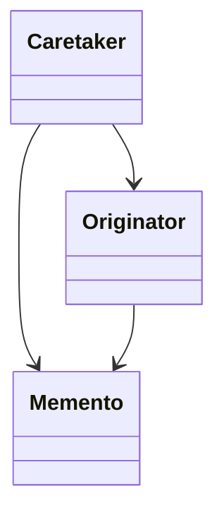

备忘录模式（Memento Pattern）是一种行为型设计模式，允许在不破坏封装的前提下，捕获一个对象的内部状态，并在以后将其恢复。该模式提供了一种让对象自行存储和恢复自身状态的机制，而不需要暴露其内部表示。

---

## **一、模式详解**

### **1. 意图**

- **主要目的**：在不违反封装的情况下，捕获对象的内部状态，并在需要时将对象恢复到之前的状态。
- **关键点**：保护对象的封装性，不让外部直接访问对象的内部状态。

### **2. 组成角色**

- **Originator（发起人）**：负责创建一个备忘录，用于记录当前时刻的内部状态，并可使用备忘录恢复内部状态。
- **Memento（备忘录）**：负责存储Originator的内部状态，并防止Originator以外的对象访问备忘录。
- **Caretaker（管理者）**：负责保存好备忘录，不能对备忘录的内容进行操作或检查。

### **3. 类图**



---

## **二、适用场景**

- **需要保存和恢复数据的场景**：例如，游戏中的存档功能、编辑器中的撤销/重做操作。
- **需要隐藏对象的实现细节**：外部对象不应直接访问对象的内部状态。
- **需要提供回滚操作的事务场景**：如数据库事务的提交和回滚。

---

## **三、C#实际项目例子**

### **例子1：文本编辑器的撤销/重做功能**

**场景说明**：在文本编辑器中，用户可能需要撤销最近的操作。

**代码实现**：

```csharp
// Memento
public class TextMemento
{
    public string Content { get; private set; }

    public TextMemento(string content)
    {
        Content = content;
    }
}

// Originator
public class TextEditor
{
    public string Content { get; set; }

    public TextMemento CreateMemento()
    {
        return new TextMemento(Content);
    }

    public void RestoreMemento(TextMemento memento)
    {
        Content = memento.Content;
    }
}

// Caretaker
public class TextCaretaker
{
    private Stack<TextMemento> _mementos = new Stack<TextMemento>();

    public void SaveState(TextEditor editor)
    {
        _mementos.Push(editor.CreateMemento());
    }

    public void Undo(TextEditor editor)
    {
        if (_mementos.Count > 0)
        {
            editor.RestoreMemento(_mementos.Pop());
        }
    }
}

// 使用示例
public void TextEditorExample()
{
    TextEditor editor = new TextEditor();
    TextCaretaker caretaker = new TextCaretaker();

    editor.Content = "第一行文本。";
    caretaker.SaveState(editor);

    editor.Content += "\n第二行文本。";
    caretaker.SaveState(editor);

    editor.Content += "\n第三行文本。";
    Console.WriteLine("当前内容：\n" + editor.Content);

    caretaker.Undo(editor);
    Console.WriteLine("\n撤销一步后内容：\n" + editor.Content);

    caretaker.Undo(editor);
    Console.WriteLine("\n再撤销一步后内容：\n" + editor.Content);
}
```

**输出结果**：

```
当前内容：
第一行文本。
第二行文本。
第三行文本。

撤销一步后内容：
第一行文本。
第二行文本。

再撤销一步后内容：
第一行文本。
```

---

### **例子2：游戏中的存档和读档功能**

**场景说明**：在游戏中，玩家可能需要在某个进度保存游戏，以便在失败后恢复。

**代码实现**：

```csharp
// Memento
public class GameStateMemento
{
    public int Level { get; private set; }
    public int Health { get; private set; }

    public GameStateMemento(int level, int health)
    {
        Level = level;
        Health = health;
    }
}

// Originator
public class GamePlayer
{
    public int Level { get; set; }
    public int Health { get; set; }

    public GameStateMemento SaveState()
    {
        return new GameStateMemento(Level, Health);
    }

    public void LoadState(GameStateMemento memento)
    {
        Level = memento.Level;
        Health = memento.Health;
    }
}

// Caretaker
public class GameCaretaker
{
    private GameStateMemento _memento;

    public void SaveGame(GamePlayer player)
    {
        _memento = player.SaveState();
    }

    public void LoadGame(GamePlayer player)
    {
        if (_memento != null)
        {
            player.LoadState(_memento);
        }
    }
}

// 使用示例
public void GameExample()
{
    GamePlayer player = new GamePlayer { Level = 5, Health = 100 };
    GameCaretaker caretaker = new GameCaretaker();

    Console.WriteLine($"当前状态：Level {player.Level}, Health {player.Health}");

    // 保存游戏
    caretaker.SaveGame(player);

    // 模拟游戏过程
    player.Level = 6;
    player.Health = 50;
    Console.WriteLine($"游戏后状态：Level {player.Level}, Health {player.Health}");

    // 加载游戏
    caretaker.LoadGame(player);
    Console.WriteLine($"读取存档后状态：Level {player.Level}, Health {player.Health}");
}
```

**输出结果**：

```
当前状态：Level 5, Health 100
游戏后状态：Level 6, Health 50
读取存档后状态：Level 5, Health 100
```

---

### **例子3：绘图软件的撤销功能**

**场景说明**：在绘图软件中，用户可能需要撤销最近的绘图操作。

**代码实现**：

```csharp
// Shape基类
public abstract class Shape
{
    public abstract Shape Clone();
}

public class Circle : Shape
{
    public int Radius { get; set; }

    public override Shape Clone()
    {
        return new Circle { Radius = this.Radius };
    }
}

public class Rectangle : Shape
{
    public int Width { get; set; }
    public int Height { get; set; }

    public override Shape Clone()
    {
        return new Rectangle { Width = this.Width, Height = this.Height };
    }
}

// Memento
public class CanvasMemento
{
    public List<Shape> Shapes { get; private set; }

    public CanvasMemento(List<Shape> shapes)
    {
        // 深拷贝
        Shapes = shapes.Select(s => s.Clone()).ToList();
    }
}

// Originator
public class DrawingCanvas
{
    public List<Shape> Shapes { get; set; } = new List<Shape>();

    public CanvasMemento SaveState()
    {
        return new CanvasMemento(Shapes);
    }

    public void RestoreState(CanvasMemento memento)
    {
        Shapes = memento.Shapes;
    }
}

// Caretaker
public class CanvasCaretaker
{
    private Stack<CanvasMemento> _mementos = new Stack<CanvasMemento>();

    public void SaveState(DrawingCanvas canvas)
    {
        _mementos.Push(canvas.SaveState());
    }

    public void Undo(DrawingCanvas canvas)
    {
        if (_mementos.Count > 0)
        {
            canvas.RestoreState(_mementos.Pop());
        }
    }
}

// 使用示例
public void DrawingCanvasExample()
{
    DrawingCanvas canvas = new DrawingCanvas();
    CanvasCaretaker caretaker = new CanvasCaretaker();

    // 绘制圆形
    canvas.Shapes.Add(new Circle { Radius = 5 });
    caretaker.SaveState(canvas);

    // 绘制矩形
    canvas.Shapes.Add(new Rectangle { Width = 10, Height = 20 });
    caretaker.SaveState(canvas);

    Console.WriteLine("当前图形数量：" + canvas.Shapes.Count);

    // 撤销操作
    caretaker.Undo(canvas);
    Console.WriteLine("撤销一步后图形数量：" + canvas.Shapes.Count);

    caretaker.Undo(canvas);
    Console.WriteLine("再撤销一步后图形数量：" + canvas.Shapes.Count);
}
```

**输出结果**：

```
当前图形数量：2
撤销一步后图形数量：1
再撤销一步后图形数量：0
```

---

## **四、总结**

备忘录模式在需要保存和恢复对象状态的场景中非常有用，特别是在需要提供撤销/重做功能的应用程序中。通过使用该模式，可以在不破坏对象封装性的前提下，实现对象状态的存档和恢复。

### **注意事项**

- **内存消耗**：频繁保存对象状态可能会占用大量内存，需要权衡保存的频率和状态的大小。
- **封装性**：确保备忘录只能被Originator访问，避免其他对象篡改备忘录的状态。
- **深拷贝**：在保存复杂对象状态时，可能需要实现深拷贝，以确保备忘录中的状态独立于原始对象。

---

希望以上内容能帮助你深入理解备忘录模式。如果你还有其他疑问，欢迎继续提问！